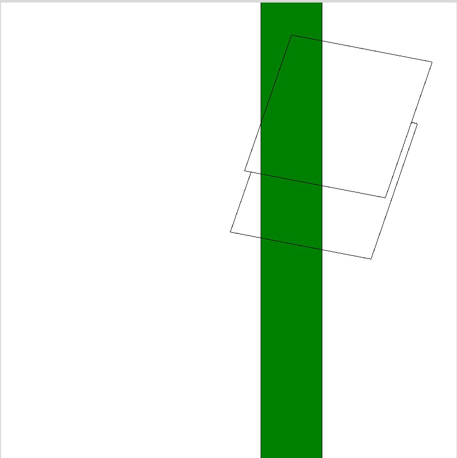

---
lang: ru
author:
- В.В. Варгасов
- Е.А. Роганов
- А.И. Александров
date: 26.04.2024
title: Отчёт о модификации проекта «Изображение проекции полиэдра»
...

## Постановка задачи

### Точная постановка задачи

>Все рёбра делятся на три класса: полностью видимые, видимые частично и
>полностью невидимые. Модифицируйте эталонный проект таким образом, чтобы
>определялась и печаталась следующая характеристика полиэдра: сумма длин
>проекций полностью видимых рёбер, проекция центра которых находится на расстоянии
>строго меньше $1$ от прямой $x = 2$.

### Интерпретация задачи и идея решения

В данной задаче требуется рассматривать проэкции вершин полиэдра на плоскость 
$Oxy$, и складывать длины таких полностью видимых ребер полиэдра, 
проекции центров которых лежат строго внутри области, ограчиченной прямыми $x = 1$
и $x = 3$.
Также необходимо реализовать графический интерфейс, отображающий заданную область
для визуального контроля правильности работы модификации.

## Подробное описание решения задачи на модификацию

1. В класс `Edge` был добвален аттрибут `special`, который указывает на то,
   является ли тот или иной экземпляр класса ребром удовлетворяющим условию или нет
   путем сравнения среднего арифмитического координат концов отрезко по оси абсцисс
   с $1$ и $3$.
2. В связи с тем, что по условию требуется вычислять сумму длин только видимых
   ребер, удовлетворяющих условию, указанному выше, было принято решение
   модифицировать метод `shadow` так, чтобы в случае невырожденной тени, значение
   аргумента `special` обнулялось.
3. Для отображения области, указанной в условии задачи, модифицруем код класса
   `TkDrawer`, добавив ему метод `draw_zone`, изображающий прямоугольник зеленого
   цвета.
4. Также модифицируем метод `draw` класса `Polyedr`, добавив после вызова метода
   `clean` вызов метода `draw_zone`.
5. Добавим классу `Polyedr` аттрибут `length`, к которому в рамках метода draw
   будем прибавлять значение длины ребра умножив его на значение аттрибута
   `special` и разделив на коэффициент гомотетии.
6. Были написаны соответствующие тесты, иллюстрирующие правильность работы 
   всех написанных методов и модификации в целом.

## Команды, использовавшиеся при получении итоговых отчетов в заданных форматах

Здесь `pdf.latex` и `HTML.html5` --- переименованные файлы шаблонов.

Команда для получения отчета в формате `pdf`, с использованием заданного 
шаблона.

~~~sh
pandoc --template pdf.latex -s --toc --lua-filter ./
include-code-files.lua report.md -o report.pdf
~~~

Команда для получения отчета в формате `html`, с использованием заданного 
шаблона.

~~~sh
pandoc -o report.html -f markdown -t html -s --toc --lua-filter ./
include-code-files.lua --mathjax --template html.html5 report.md
~~~

Команда для получения отчета в формате `docx`.

~~~sh
pandoc -s report.md --toc --lua-filter ./include-code-files.lua 
-o report.docx
~~~

## Примеры тестов для поддтверждения корректности работы модификации

- Коробка, шесть из восьми вершин которой попадают в заданное кольцо.

~~~{.py include="ccc.py"}
~~~

- Куб, шесть из восьми вершин которого попадают в заданное кольцо.

~~~{.py include="box.py"}
~~~