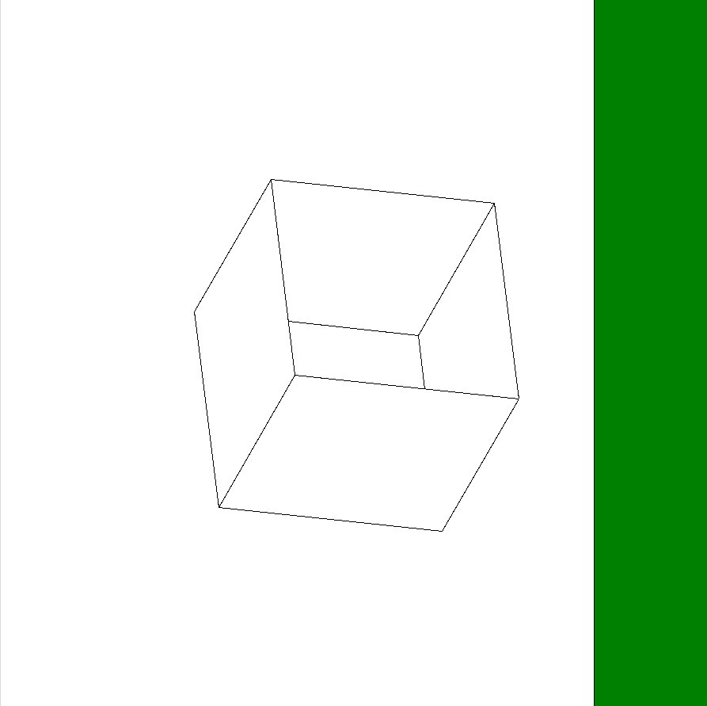

---
lang: ru
author:
- И.Д. Соловьев
- Е.А. Роганов
- А.И. Александров
date: 26.04.2024
title: Отчёт о модификации проекта «Изображение проекции полиэдра»
...

## Постановка задачи

### Точная постановка задачи

>Назовём точку в пространстве «хорошей», если её проекция находится строго 
>внутри окружности $x^2+y^2 = 4,$ но строго вне окружности $x^2+y^2 = 1.$ 
>Модифицируйте эталонный проект 
>таким образом чтобы определялась и печаталась следующая характеристика 
>полиэдра: сумма длин рёбер, оба из концов которых — «хорошие» точки.

### Интерпретация задачи и идея решения

В данной задаче требуется рассматривать проэкции вершин полиэдра на плоскость 
$Oxy$, и складывать длины таких ребер полиэдра, оба конца которых попадают в
заданное кольцо, то есть удовлетворяют неравенству:
$$1\leqslant M_x^2+M_y^2\leqslant4,$$
где $M$ --- рассматриваемая точка. Также необходимо реализовать графический
интерфейс, отображающий заданное кольцо для визуального контроля правильности
работы модификации.

## Подробное описание решения задачи на модификацию

1. В класс `R3` был добвален метод, проверяющий,
   является ли переданная точка «хорошей», при помощи подстановки ее $x$ и $y$
   координат в рассмотренное при постановке задачи неравенство.
2. Было принято решение выявлять ребра, оканчивающиеся «хорошими» точками на
   этапе задания ребер для каждой грани в методе `__init__` класса `Polyedr`
3. Так как некоторые ребра могут принадлежать одной или двум граням, в 
   зависимости от конфигурации полиэдра, то необходио проверять, было ли ранее
   посчитано рассматриваемое ребро, или нет. Самой простой с точки зрения
   написания кода проверкой в данном случае является двумерный массив 
   смежности. Это «таблица», по столбцам и строкам которой расположены все 
   вершины полиэдра, ячейки заполнены единицами. Когда вычисляется сумма
   очередного ребра, ячейка на пересечении строки и столбца с соответствующими 
   вершинами начала и конца ребра заполняется нулем.
4. Также в метод `__init__` класса `Polyedr` был добавлен дополнительный 
   массив вершин, с непреобразованными координатами, чтобы в полученной 
   суммарной длине не учитывался коэффициент гомотетии.
5. Вычисление длины рёбер было реализовно с помощью операции взятия квадратного
   корня из скалярного произведения.
6. Была добавлена отправка в стандартный вывод информации о длинне ребер, 
   подходящих под условие.
7. В класс `Polyedr` добавляется метод `print_good_sum(self)`, возвращающий 
   искомую сумму длин рёбер с «хорошими» точками на концах.
8. В методе `draw` класса `Polyedr` была добавлена отрисовка кольца и проекций 
   точек, при этом учтен коэффициент гомотетии для корректного отображения
   кольца.
9. Были написаны соответствующие тесты, иллюстрирующие правильность работы 
   всех написанных методов и модификации в целом.

## Команды, использовавшиеся при получении итоговых отчетов в заданных форматах

Здесь `pdf.latex` и `HTML.html5` --- переименованные файлы шаблонов.

Команда для получения отчета в формате `pdf`, с использованием заданного 
шаблона.

~~~sh
pandoc --template pdf.latex -s --toc --lua-filter ./include-code-files.lua report.md -o report.pdf
~~~

Команда для получения отчета в формате `html`, с использованием заданного 
шаблона.

~~~sh
pandoc -o report.html -f markdown -t html -s --toc --lua-filter ./include-code-files.lua --mathjax --template html.html5 report.md
~~~

Команда для получения отчета в формате `docx`.

~~~sh
pandoc -s report.md --toc --lua-filter ./include-code-files.lua -o report.docx
~~~

## Примеры тестов для поддтверждения корректности работы модификации

- Коробка, шесть из восьми вершин которой попадают в заданное кольцо.

~~~{.py include="box.py"}
~~~

- Куб, шесть из восьми вершин которого попадают в заданное кольцо.

~~~{.py include="cube.py"}
~~~